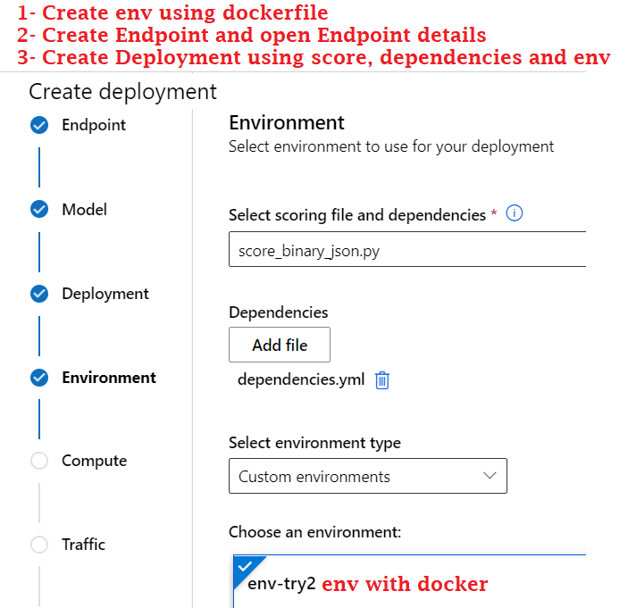

# Azure Machine Learning Model Deployment 

This repository is to set up prediction function for data science / machine learning deployment project using Azure Machine Learning. (https://ml.azure.com)

# Usage

# Documentation

## Code structure

| File/folder                   | Description                                |
| ----------------------------- | ------------------------------------------ |
| `Dockerfile`                        | Needed for installing environment dependencies in custom environment |
| `dependencies.yml`                  | Needed dependencies for python. |
| `score.py`        | Inference script that is used to score image encoded to binary json with rawhttp and that gets executed within the container when you send data to the deployed model on Azure Machine Learning. |
| `consume.py`                 | Consume file to send image to model artifact on Azure Machine Learning Endpoint |

### **@Author**: Süleyman Gölbol